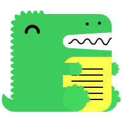
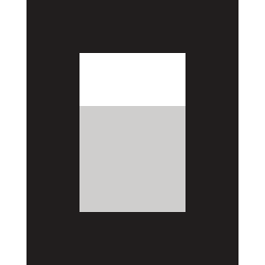
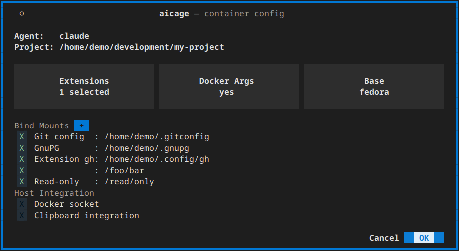
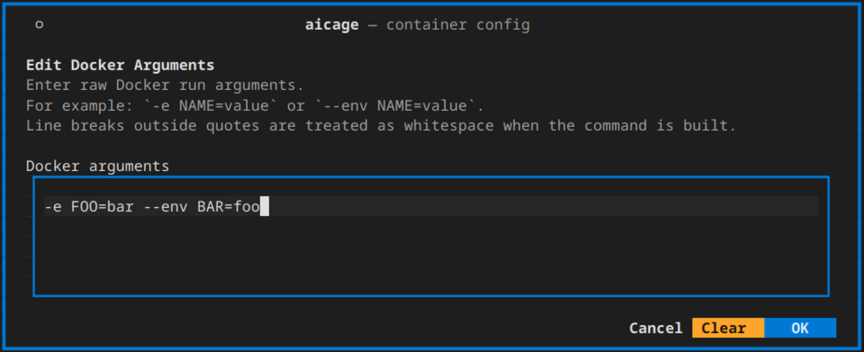
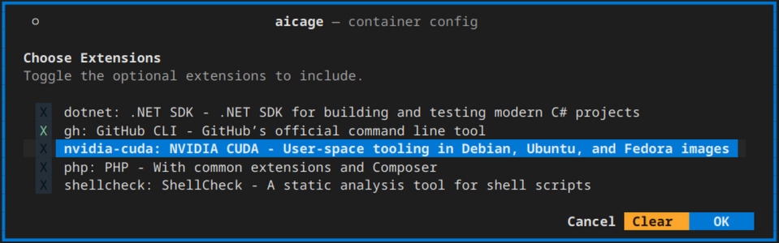

# aicage

Give coding agents your project files, not your whole computer.

`aicage` runs AI coding agents in containers while you work on the same local project files.

## Why use `aicage`?

Agents need deep access (read code, run commands, install dependencies).
Their built-in safety checks are naturally limited.

Running agents in containers gives a hard boundary – with `aicage` the experience stays the same.

- Work with the same project files as the agent
- Configure shared folders, agent images, and runtime options
- Same paths and user inside the container[^windows-paths]
- Pre-built and tested images
- Automatic updates for agents and images

[^windows-paths]: On Windows, run `aicage` from WSL for matching paths and user. Native Windows paths are mounted under
`/mnt/<drive>` and the container runs as `root`.

See [Why cage agents?](#why-cage-agents) for the full rationale.

## Built-in agents

Use one of these builtin CLI agents or
[add your own](https://github.com/aicage/aicage/wiki/Customization#customization).

<!-- pyml disable line-length,no-inline-html -->
<!-- markdownlint-disable line-length -->
<table>
  <tr>
    <td> <a href="https://ampcode.com/docs/cli">Amp CLI</a> · <code>amp</code></td>
    <td><a href="https://docs.augmentcode.com/cli">Auggie CLI</a> · <code>auggie</code></td>
    <td> <a href="https://claude.com/product/claude-code">Claude Code</a> · <code>claude</code></td>
  </tr>
  <tr>
    <td> <a href="https://developers.openai.com/codex/cli">Codex CLI</a> · <code>codex</code></td>
    <td><a href="https://github.com/features/copilot/cli">GitHub Copilot CLI</a> · <code>copilot</code></td>
    <td><a href="https://factory.ai/product/cli">Factory CLI</a> · <code>droid</code></td>
  </tr>
  <tr>
    <td> <a href="https://goose-docs.ai">Goose CLI</a> · <code>goose</code></td>
    <td><a href="https://kiro.dev/cli/">Kiro CLI</a> · <code>kiro-cli</code></td>
    <td> <a href="https://opencode.ai">OpenCode</a> · <code>opencode</code></td>
  </tr>
  <tr>
    <td> <a href="https://qwenlm.github.io/qwen-code-docs">Qwen Code</a> · <code>qwen</code></td>
    <td> <a href="https://docs.mistral.ai/vibe/code/">Mistral Vibe CLI</a> · <code>vibe</code></td>
    <td></td>
  </tr>
</table>
<!-- markdownlint-enable line-length -->
<!-- pyml enable line-length,no-inline-html -->

## Quick start

Install:

```bash
pipx install aicage
```

### First run

In your project directory, start the agent you want to use:

```bash
aicage <agent>
```

Accept the setup choices, then sign in or confirm that the agent is already signed in.

> - Prefer file-based credential storage or API keys; keyring-based auth does not work.
> - If sign-in fails, sign in with the agent on the host, then try again.

### Use aicage in your IDE

Use your agent in your IDE while aicage runs it in a Docker container.

#### Visual Studio Code

1. Install [ACP Client](https://marketplace.visualstudio.com/items?itemName=formulahendry.acp-client).
2. In the plugin settings, add your agent’s config from the
   [Visual Studio Code configuration](config/ide-plugins/VScode/settings.json) into the `settings.json`.

#### JetBrains

1. Install [AI Assistant](https://www.jetbrains.com/help/ai-assistant/activate-agents.html).
2. In the plugin’s settings, add your agent’s config from the
   [JetBrains configuration](config/ide-plugins/JetBrains/acp.json) as a
   [custom ACP agent](https://www.jetbrains.com/help/ai-assistant/activate-agents.html#add-acp-agents).  
   Replace `/path/to/aicage` with the full path to `aicage`.

#### ACP Bridge for Amp, Claude, and Codex

These agents need one additional ACP bridge. Install the bridge for the agent you use:

```bash
# Run only the command for your agent.
npm install -g amp-acp
npm install -g @agentclientprotocol/claude-agent-acp
npm install -g @agentclientprotocol/codex-acp
```

In JetBrains, replace the bridge's `/path/to/...` in the config above with its full path.

## Change a project's setup

Run `aicage <agent>` from the project directory to change the agent's container setup. Your IDE uses the saved
project configuration.

### Configuration menu

After `aicage <agent>` starts, you will see this setup overview:



The overview brings the most common choices together in one place:

- `Agent`: the built-in or custom agent you want to run.
- `Bind Mounts`: extra host files and directories the container should be able to access.
- `Base`: the base image used for the agent image. The suggested default is best for most users.
- `Extensions`: optional local additions that install tools or request extra host shares.
- `Docker Args`: extra `docker run` arguments such as `-e`, `-p`, or `--network`.
- `Docker socket`: lets the agent use Docker on the host when you explicitly enable it.
- `OK`: saves the current project config for that agent and starts the container.

## Common project changes

### Bind mounts

Use `Bind Mounts` when the agent needs access to files or directories outside the project.

### Docker args

To adjust how the container starts, open `Docker Args` in the setup screen.



Use it for normal `docker run` arguments such as:

```bash
-e FOO=bar
-p 3000:3000
--network my-net
```

See [Docker run pass-through args](https://github.com/aicage/aicage/wiki/Docker-Args).

### Extensions

Extensions let you add tools on top of an existing agent image. Quick start:



```bash
git clone https://github.com/aicage/aicage-custom-samples.git $HOME/.aicage-custom
```

Then rerun `aicage <agent>` and select the extension in the setup screen.
See [Extensions](https://github.com/aicage/aicage/wiki/Customization-Extensions).

### Docker socket access

If you want the agent to run Docker commands, enable `Docker socket` in the setup screen.

## Full documentation

The complete user documentation lives in the [aicage.wiki](https://github.com/aicage/aicage/wiki).

## Common scenarios

- First-use setup issues:
  - See [Known hiccups](https://github.com/aicage/aicage/wiki/Known-Hiccups).
- On Windows:
  - Set `git config --global core.autocrlf true` on the Windows host to avoid line-ending diffs.
- Pass arguments to the agent:
  - `aicage <agent> resume <session-id>`
- Share additional host folders:
  - Use `Shares` or extension-provided shares in the setup UI.
- Use proxies:
  - `aicage` forwards `HTTP_PROXY`, `HTTPS_PROXY`, `ALL_PROXY`, and `NO_PROXY`.
  - See [CLI options](https://github.com/aicage/aicage/wiki/CLI-Options).
- Use host networking or custom networks:
  - See [Host networking](https://github.com/aicage/aicage/wiki/Host-Networking).
- On macOS with native Docker:
  - See [Known hiccups](https://github.com/aicage/aicage/wiki/Known-Hiccups) for the current support caveat.
- Add custom tools, agents, or base images:
  - [Extensions](https://github.com/aicage/aicage/wiki/Customization-Extensions)
  - [Custom agents](https://github.com/aicage/aicage/wiki/Customization-Agents)
  - [Custom base images](https://github.com/aicage/aicage/wiki/Customization-Base-Images)

## Customization

`aicage` lets you customize images at three levels:

- `extensions`: Add software and shared files/folders
- `agents`: Add other agents
- `base images`: Custom agent environments

The sample repo is a fast way to see working examples and copy a template.

Quick start:

```bash
git clone https://github.com/aicage/aicage-custom-samples.git $HOME/.aicage-custom
```

Then run any agent:

```bash
aicage <agent>
```

These are only samples. Use them to learn the structure, then replace or edit them with your own definitions.
`aicage` detects whatever you place under `~/.aicage-custom` and offers it during selection.

Extensions can install tools and request additional host mounts.

After adding or changing custom definitions, restart `aicage`.

- Extensions: [Customization-Extensions](https://github.com/aicage/aicage/wiki/Customization-Extensions)
- Custom agents: [Customization-Agents](https://github.com/aicage/aicage/wiki/Customization-Agents)
- Custom base images: [Customization-Base-Images](https://github.com/aicage/aicage/wiki/Customization-Base-Images)

Image updates are handled automatically; see [Updates](https://github.com/aicage/aicage/wiki/Updates).

## Why cage agents?

You should not have to choose between approving every small step and giving an agent access to your whole computer.

Agent restrictions and approval prompts get in the way of real work. But turning them off gives the agent access to
everything your user account can read or change, far beyond the project.

`aicage` gives the agent a container with your project files and only the extra access you choose. The rest of your
computer stays out of reach.
