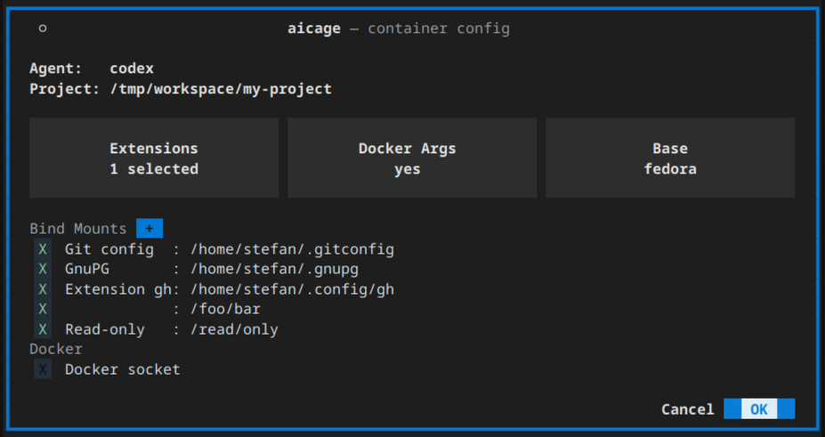
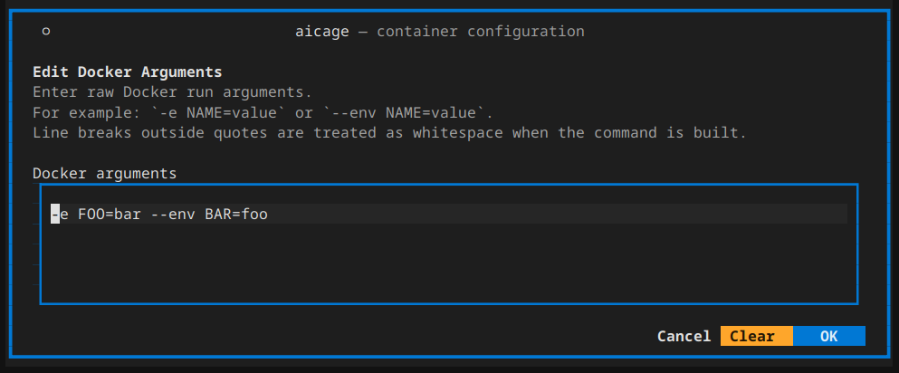
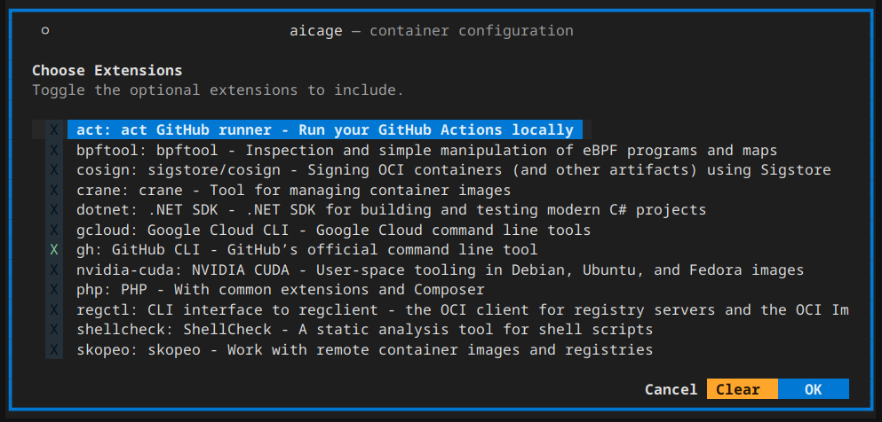

# aicage wiki

Run AI coding agents in Docker with a clean separation between your host and the agent runtime.

## Quick start

Install:

```bash
pipx install aicage
```

In your project directory, run:

```bash
aicage <agent>
```

For a first useful run, you can simply press Enter or select `OK` in the setup overview.

Built-in agent examples:

```bash
aicage agy
aicage claude
aicage codex
aicage copilot
aicage crush
aicage droid
aicage gemini
aicage goose
aicage opencode
aicage qwen
```

`aicage` mounts your project and your agent config into a container that already has a full dev
toolchain and the agent.

You can also add your own custom agents. See [Customization](Customization).

## What you see first

After `aicage <agent>` starts, you will see this setup overview:



The overview brings the most common choices together in one place:

- `Agent`: the built-in or custom agent you want to run.
- `Base`: the base image used for the agent image. The suggested default is best for most users.
- `Extensions`: optional local additions that install tools or request extra host shares.
- `Docker Args`: extra `docker run` arguments such as `-e`, `-p`, or `--network`.
- `Docker socket`: lets the agent use Docker on the host when you explicitly enable it.
- `OK`: saves the current project config for that agent and starts the container.

## Common next steps

### Docker args

If something about the container startup needs adjusting, open `Docker Args` in the setup screen.



Use it for normal `docker run` arguments such as:

```bash
-e FOO=bar
-p 3000:3000
--network my-net
```

See [Docker run pass-through args](Docker-Args).

### Extensions

Extensions let you add tools on top of an existing agent image. Quick start:



```bash
git clone https://github.com/aicage/aicage-custom-samples.git $HOME/.aicage-custom
```

Then rerun `aicage <agent>` and select the extension in the setup screen.
See [Extensions](Customization-Extensions).

### Docker socket access

If you want the agent to run Docker commands, enable `Docker socket` in the setup screen.

## Common scenarios

- The agent itself needs arguments:
  - Run `aicage <agent> ...` with the agent arguments after the agent name, for example
    `aicage codex resume <session-id>`.
- Software or tools are missing inside the container:
  - Add an [extension](Customization-Extensions) to install tools on top of the agent image.
- The container needs extra environment variables, ports, or network settings:
  - Set them in `Docker Args` in the setup screen.
- The agent should be able to run Docker commands:
  - Enable `Docker socket` in the setup screen.
- The container needs access to more host files:
  - Add shares in the setup screen, or use extension-provided shares.
- Networking or proxy behavior needs special handling:
  - See [Docker run pass-through args](Docker-Args) and [Host networking](Host-Networking).
- Run into first-use setup issues:
  - See [Known hiccups](Known-Hiccups).
- Add custom tools, agents, or base images:
  - [Customization](Customization)
  - [Extensions](Customization-Extensions)
  - [Custom agents](Customization-Agents)
  - [Custom base images](Customization-Base-Images)

## Built-in agents

| CLI      | Agent              | Homepage                                                                                     |
|----------|--------------------|----------------------------------------------------------------------------------------------|
| agy      | Antigravity CLI    | [https://antigravity.google/docs/cli-overview](https://antigravity.google/docs/cli-overview) |
| claude   | Claude Code        | [https://claude.com/product/claude-code](https://claude.com/product/claude-code)             |
| codex    | Codex CLI          | [https://developers.openai.com/codex/cli](https://developers.openai.com/codex/cli)           |
| copilot  | GitHub Copilot CLI | [https://github.com/features/copilot/cli](https://github.com/features/copilot/cli)           |
| crush    | Crush              | [https://github.com/charmbracelet/crush](https://github.com/charmbracelet/crush)             |
| droid    | Factory CLI        | [https://factory.ai/product/cli](https://factory.ai/product/cli)                             |
| gemini   | Gemini CLI         | [https://geminicli.com](https://geminicli.com)                                               |
| goose    | Goose CLI          | [https://goose-docs.ai](https://goose-docs.ai)                                               |
| opencode | OpenCode           | [https://opencode.ai](https://opencode.ai)                                                   |
| qwen     | Qwen Code          | [https://qwenlm.github.io/qwen-code-docs](https://qwenlm.github.io/qwen-code-docs)           |

## More reading

- [Customization](Customization)
- [Docker run pass-through args](Docker-Args)
- [Host networking](Host-Networking)
- [Update behavior](Updates)
- [Known hiccups](Known-Hiccups)
- [Security and trust](Security-and-Trust)
- [How it works](How-It-Works)
- [How to debug](How-To-Debug)
- [CLI options](CLI-Options)
- [Images and layers](Images)
- [Base image tooling](Base-Image-Tooling)
